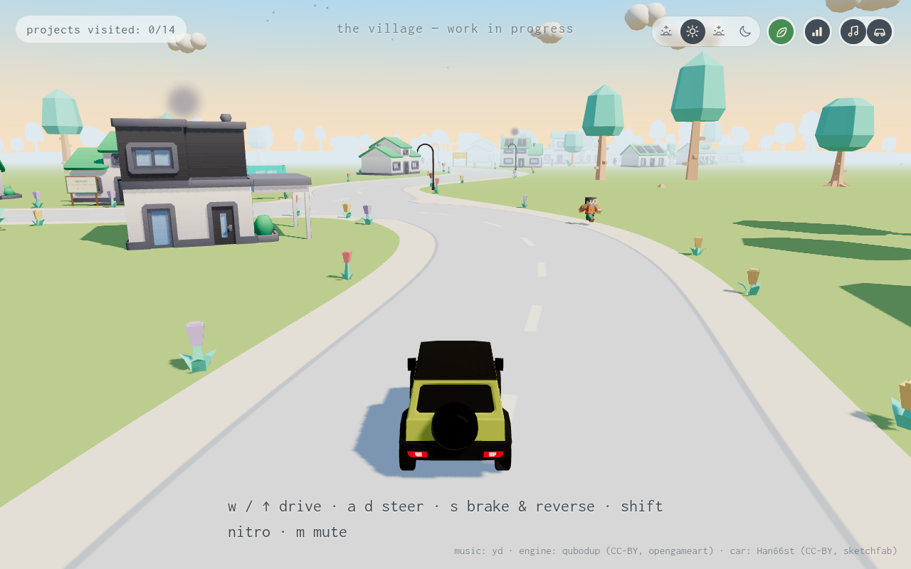

# Super Jackfruit website

[](package.json)
[](src/scripts/)
[](#explore)

**The public face of Super Jackfruit Labs: a project catalogue and an interactive
driving village, built with Astro, Three.js, TypeScript and Tailwind.**

[Website](https://superjackfruit.com) ·
[Current plan](docs/VILLAGE_WEBSITE_PLAN.md) ·
[Agentnagar design](https://github.com/SuperJackfruitLabs/agentnagar/blob/main/README.md)



*The current `/village` route, captured from a local production build. This
shows the website prototype, not the planned Agentnagar multiplayer city.*

## Explore

| Route | Experience |
| --- | --- |
| `/` | Neon street project catalogue |
| `/village` | Drive between project buildings in a Three.js village |

In the village, use **W / ↑** to drive, **A / D** to steer, **S** to brake or
reverse, **Shift** for nitro, and **M** to mute. Touch controls are also
available. The interface exposes day/night, season, quality and music controls;
visit progress is saved in the browser.

The site is a frontend experience. The larger simulation, native game,
multiplayer and residency remain proposed work in
[Agentnagar](https://github.com/SuperJackfruitLabs/agentnagar).
Catalogue text should be checked against each product's current source and
releases before it is used as evidence of availability.

## Develop locally

Use Node.js 22 or newer and npm with the checked-in lockfile:

```sh
npm ci
npm run dev
```

Open the local URL printed by Astro, then visit `/` or `/village`.

```sh
npm test          # Node tests for visit-state behavior
npm run build    # Astro checks, then static output in dist/
npm run preview  # Inspect the production build locally
```

For visual changes, inspect both routes and the affected controls in a browser;
the visit-state tests do not validate the 3D scene. See [package.json](package.json)
for the exact scripts.

## Repository map

| Path | Responsibility |
| --- | --- |
| [src/pages/](src/pages/) | Astro routes |
| [src/data/](src/data/) | Project catalogue and model manifest |
| [src/scripts/street-scene.ts](src/scripts/street-scene.ts) | Neon street scene |
| [src/scripts/village/](src/scripts/village/) | Driving, world and village mechanics |
| [public/assets/village/](public/assets/village/) | Assets served to the browser |
| [assets-src/](assets-src/) and [scripts/](scripts/) | Source kits and extraction/compression tools |
| [docs/](docs/) | Internal plans, outside published assets |

`npm run assets` extracts and compresses the existing model kit. It is an asset
rebuild step, not a prerequisite for every development session. Preserve asset
attributions, including Kenney kits, Han66st's car and the audio credits shown
in the village. The [Kenney NPC license](assets-src/npc-kit/KENNEY-LICENSE.txt)
and source credits record third-party terms; the repository does not currently
declare a repository-wide license.

## Deployment and project boundaries

`npm run deploy` builds and publishes to the configured Cloudflare Pages project.
It uses the pinned local Wrangler installed by `npm ci`; no global installation
is required. Authenticate with `npx wrangler login` before the first deployment.
Run the deployment script only when publishing is intended, and inspect its
project/branch in [package.json](package.json) before changing the destination.

The [current website plan](docs/VILLAGE_WEBSITE_PLAN.md) owns catalogue repair,
navigation and website integration. `docs/superpowers/` contains historical
design stages. Agentnagar owns the city/game plan; the
[marketing workspace](https://github.com/SuperJackfruitLabs/sjl-marketing)
owns strategy and product evidence. A local build or screenshot does not
establish what is deployed on the public domain.
